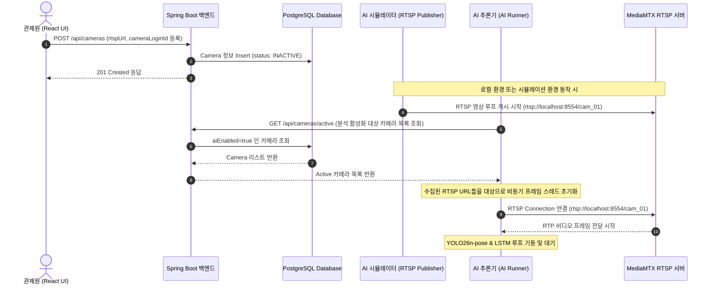

# 시스템 아키텍처 (ARCHITECTURE)

본 문서는 스마트 안전 관제 시스템의 전체 기술 아키텍처와 컴포넌트별 책임 범위, 실시간 데이터 흐름을 상세하게 설명합니다.

---

## 🏗️ 전체 시스템 구조

시스템은 높은 처리량과 저지연 실시간성을 달성하기 위해 **AI 추론 엔진(비동기 비전 파이프라인)**, **웹 백엔드 서버(메시지 브로커 & 라우팅)**, **웹 프론트엔드 대시보드(실시간 시각화)**의 3계층 구조로 분리되어 있습니다.

```mermaid
graph TD
    subgraph CCTV / Video Source
        CCTV_1[CCTV Cam 1] -->|RTSP Stream| MediaMTX[MediaMTX Stream Server]
        CCTV_2[CCTV Cam 2] -->|RTSP Stream| MediaMTX
    end

    subgraph AI Pipeline (strange_ai)
        MediaMTX -->|RTSP Stream| OpenCV[OpenCV Frame Reader]
        OpenCV -->|Frames| YOLO[YOLO26n-pose Extractor]
        YOLO -->|Keypoints| Tracker[ByteTrack Fallback Tracker]
        Tracker -->|Sequence Buffer| LSTM[LSTM Action Classifier]
        LSTM -->|Faint Detected| MQTT_Pub[MQTT Client Publisher]
    end

    subgraph Messaging Infrastructure
        MQTT_Pub -->|safety/events| Broker[MQTT Broker EMQX/Mosquitto]
    end

    subgraph Backend Server (strange_back)
        Broker -->|Subscribe| SpringBoot[Spring Boot Service]
        SpringBoot -->|Persist Alert| PostgreSQL[(PostgreSQL DB)]
        SpringBoot -->|Broadcast Frame| STOMP[WebSocket STOMP Server]
    end

    subgraph Frontend Dashboard (strange_front)
        STOMP -->|/topic/facility/{id}/alerts| React[React Dashboard]
        MediaMTX -->|HLS Stream| ReactVideo[React CCTV HLS Player]
    end

    classDef ai fill:#f9f,stroke:#333,stroke-width:2px;
    classDef back fill:#bbf,stroke:#333,stroke-width:2px;
    classDef front fill:#bfb,stroke:#333,stroke-width:2px;
    classDef infra fill:#fdb,stroke:#333,stroke-width:2px;

    class OpenCV,YOLO,Tracker,LSTM,MQTT_Pub ai;
    class SpringBoot,STOMP back;
    class React,ReactVideo front;
    class MediaMTX,Broker,PostgreSQL infra;
```

---

## 🤝 컴포넌트별 책임 분리 (Separation of Concerns)

### 1. 인공지능 시뮬레이터 / 분석 엔진 (strange_ai)
* **비디오 프레임 캡처 및 전처리:** RTSP 스트림 서버(`MediaMTX`)로부터 실시간 프레임을 수신하여 프레임 드롭 기법(지연 누적 방지)을 통해 최신 프레임을 유지합니다.
* **객체 및 키포인트 추출:** `YOLO26n-pose` 모델을 사용하여 각 사람의 Bounding Box와 17개 관절(Keypoints) 위치 및 신뢰도를 추출합니다.
* **다중 객체 추적 (Multi-Object Tracking):** `ByteTrack` 기반 IoU 결합 알고리즘을 사용해 각 개인에게 유일한 `track_id`를 할당하고 추적 상태를 관리합니다.
* **시퀀스 행동 분석 및 디바운싱:** 30프레임 단위로 수집된 각 객체의 관절 이력을 `LSTM` 모델에 입력해 Normal/Faint 확률을 계산하며, 일정 기준치 초과(Threshold) 및 프레임 조건(Consecutive count) 만족 시 경보를 발행합니다.
* **경보 전송:** MQTT 프로토콜 규격에 맞춰 `safety/events` 토픽으로 JSON Payload를 발행합니다.

### 2. 백엔드 서비스 (strange_back)
* **카메라 구성 관리 (CRUD):** 관제 대상 카메라(CCTV)의 IP, RTSP URL, 이름, 상태 정보 등을 데이터베이스에 등록, 수정, 삭제하고 클라이언트에 제공합니다.
* **MQTT 메시지 수신 및 파싱:** AI 엔진이 발행한 MQTT 이벤트를 구독(Subscribe)하고 DTO(`SafetyEventDto`)로 역직렬화합니다.
* **이벤트 영속화:** 감지된 이상 행동 이벤트를 PostgreSQL의 `alert_events` 테이블에 저장합니다.
* **실시간 경보 방송:** 저장 완료된 경보를 WebSocket STOMP 프로토콜인 `/topic/facility/{facilityId}/alerts` (또는 기업용 `/topic/company/{companyId}/alerts`) 목적지로 일괄 송출합니다.

### 3. 프론트엔드 대시보드 (strange_front)
* **실시간 알림 청취:** 가볍고 의존성 충돌이 없는 커스텀 STOMP 웹소켓 클라이언트를 활용해 `/topic/facility/{id}/alerts` 메시지를 실시간으로 수신합니다.
* **도면 및 알림 맵핑:** 수신된 카메라 ID(`cameraLoginId`)를 기준으로 SVG 평면도 상의 관련 CCTV 카메라 아이콘을 깜빡이게 처리하고 사이렌 소리를 반복 출력합니다.
* **비디오 렌더링:** 사용자가 카메라를 선택하거나 경보 발생 카드를 클릭할 때, MediaMTX의 HLS 중계 주소(`http://localhost:8888/{cameraLoginId}/index.m3u8`)를 참조하여 `Hls.js` 플레이어에 실시간 스트리밍 영상을 로드합니다.

---

## 🔄 핵심 파이프라인 데이터 흐름

### 1. 실시간 영상 분석 및 감지 흐름
1. **RTSP 영상 입력**
   * CCTV 장비가 `MediaMTX` 서버로 RTSP 영상 스트림을 송출합니다.
2. **사람/키포인트 추출**
   * AI 분석기가 스트림에서 캡처한 이미지 프레임을 `YOLO26n-pose` 모델에 입력하여 사람의 위치(Bbox) 및 17개 키포인트 좌표를 추출합니다.
3. **ByteTrack 기반 추적**
   * 검출된 키포인트 정보와 이전 프레임의 추적 상태를 매칭해 객체별 고유 ID(`track_id`)를 계속 유지합니다.
4. **키포인트 Sequence Buffer 생성**
   * 각 `track_id`별로 30프레임 길이의 키포인트 이력을 담는 고유 원형 버퍼를 업데이트합니다.
5. **LSTM 분류 모델 실행**
   * 30프레임 버퍼가 충족되면 LSTM 모델에 입력해 `Faint`(실신/쓰러짐) 행동 확률 값을 실시간 산출합니다.
6. **MQTT 이벤트 발행**
   * 연속으로 Faint 확률이 기준치(예: 0.3)를 일정 횟수 넘고, 카메라 쿨다운 시간(10초)이 경과했다면 MQTT Broker의 `safety/events` 토픽으로 JSON 포맷 이벤트를 발행합니다.

### 2. 백엔드 수신 및 알림 브로드캐스트 흐름
1. **MQTT Subscribe**
   * Spring Boot의 `MqttSafetyEventSubscriber`가 Broker의 `safety/events` 토픽에서 경보 이벤트를 읽어옵니다.
2. **DB 저장**
   * 이벤트 유효성을 확인한 후, PostgreSQL 데이터베이스에 `alert_events` 엔티티로 저장합니다.
3. **WebSocket 브로드캐스팅**
   * 백엔드의 STOMP 메시지 브로커가 `/topic/facility/{id}/alerts`를 구독 중인 모든 React 클라이언트에 경보 JSON 객체를 전송합니다.

### 3. 프론트엔드 실시간 화면 표시 흐름
1. **WebSocket 수신**
   * React 웹 페이지 내의 `useAiEvents` 훅이 STOMP 프레임을 파싱하여 상태(`feedState`)에 수신된 이상행동 이벤트를 밀어 넣습니다.
2. **시각 및 청각 피드백**
   * 대시보드 화면 하단에 경보 카드가 팝업되고, 오디오 알람이 2초 간격으로 반복 재생됩니다.
   * `CCTVFloorPlan.tsx` 내부 SVG 평면도 상에서 감지된 카메라 ID에 해당하는 위치의 카메라 아이콘이 빨간색 펄스 애니메이션으로 강조 표시됩니다.
3. **HLS 라이브 스트림 전환**
   * 관제사가 알림 카드를 클릭하거나 Confirm 버튼을 누르면, 대상 카메라의 HLS URL이 `CCTVVideoPlayer.tsx`에 인스턴스화된 `Hls.js` 플레이어에 주입되어 실시간 현장 비디오 화면을 띄워줍니다.

---

## 🎥 카메라 등록 및 AI 스트림 처리 아키텍처 흐름

관제 시스템 대시보드에서 새로운 카메라가 등록되고 분석 스트림이 개시되는 세부 흐름도입니다.


